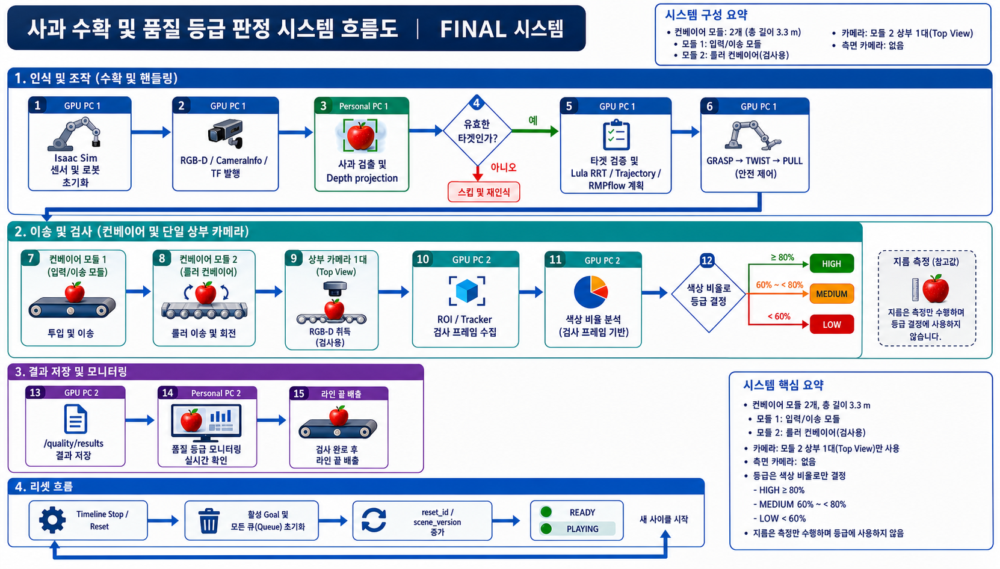

# Isaac Sim 사과 수확·품질 검사 시스템

NVIDIA Isaac Sim과 ROS 2 Jazzy를 이용해 사과를 수확하고 컨베이어에서 품질을
검사하는 다중 PC 시스템이다. GPU PC 1이 시뮬레이션과 로봇 실행을 담당하고,
개인 PC 1은 수확 target을 계산하며, GPU PC 2는 품질 결과를 생성하고, 개인 PC 2는
운영 상태를 표시한다.

## 1. 시스템 설계와 전체 흐름



```text
GPU PC 1 Isaac Sim
  ├─ RGB-D·CameraInfo·TF·/clock 발행
  ├─ 사과 수확·컨베이어 투입 실행
  └─ /conveyor/checkpoint_events
       ├─► 개인 PC 1: 검출·depth projection·world target
       │       └─ /<robot_id>/harvest/target ─► GPU PC 1
       └─► GPU PC 2: ROI/tracker·검사 프레임 구성·착색률 계산
                └─ /quality/results ─► 개인 PC 2 모니터
```

품질 등급은 착색률로 결정한다.

| 등급 | 조건 |
|---|---|
| `HIGH` | `color_ratio >= 0.80` |
| `MEDIUM` | `0.60 <= color_ratio < 0.80` |
| `LOW` | `color_ratio < 0.60` |

`diameter_mm`은 측정값으로 전달하며 등급 계산에는 사용하지 않는다.

## 2. PC별 역할과 주요 파일

| PC | 역할 | 주요 파일 |
|---|---|---|
| GPU PC 1 | Isaac Sim, 물리·센서·TF·컨베이어, Lula RRT/RMPflow, 로봇 실행·안전 감시 | `vision_apple_pick.py`, `apple_pick.py`, `conveyor_camera_publish.py`, `base_camera_publish.py` |
| GPU PC 2 | 컨베이어 영상 수신, ROI/tracker, 검사 프레임 구성, 품질 추론·통합 | `quality_grading_system/conveyor_camera_adapter_node.py`, `quality_grading_system/quality_inspection_node.py` |
| 개인 PC 1 | RGB-D 사과 검출, depth projection, world target 발행, RViz | `base_apple_detector.py`, `harvest_multi_robot.launch.py` |
| 개인 PC 2 | 품질 결과·checkpoint 모니터링과 운영 로그 | `appleproj_personal_pc2/` |

## 3. ROS 2 통신

모든 PC는 ROS 2 Jazzy, Fast DDS, `ROS_DOMAIN_ID=101`을 사용한다. 모든 노드는
`use_sim_time=true`이며 시간 기준은 Isaac Sim의 `/clock`이다.

### 수확·시뮬레이션

| 이름 | 타입 | 송신 → 수신 |
|---|---|---|
| `/<robot_id>/base_camera/color/image_raw` | `sensor_msgs/msg/Image` | GPU PC 1 → 개인 PC 1 |
| `/<robot_id>/base_camera/depth/image_raw` | `sensor_msgs/msg/Image` | GPU PC 1 → 개인 PC 1 |
| `/<robot_id>/base_camera/camera_info` | `sensor_msgs/msg/CameraInfo` | GPU PC 1 → 개인 PC 1 |
| `/<robot_id>/harvest/target` | `appleproj_interfaces/msg/HarvestTarget` | 개인 PC 1 → GPU PC 1 |
| `/<robot_id>/harvest/perception_status` | `appleproj_interfaces/msg/HarvestPerceptionStatus` | 개인 PC 1 → GPU PC 1 |
| `/<robot_id>/harvest/robot_motion` | `appleproj_interfaces/action/RobotMotion` | GPU PC 1 내부 |
| `/<robot_id>/harvest/motion_status` | `appleproj_interfaces/msg/MotionStatus` | GPU PC 1 → 모니터 |
| `/simulation/state` | `appleproj_interfaces/msg/SimulationState` | GPU PC 1 → 전체 |
| `/planning_scene` | `appleproj_interfaces/msg/PlanningScene` | GPU PC 1 → 개인 PC 1 |
| `/clock` | `rosgraph_msgs/msg/Clock` | Isaac Sim → 전체 |
| `/tf`, `/tf_static` | `tf2_msgs/msg/TFMessage` | GPU PC 1 → 개인 PC 1/RViz |

### 품질 검사

| 이름 | 타입 | 송신 → 수신 |
|---|---|---|
| `/conveyor_camera/color/image_raw` | `sensor_msgs/msg/Image` | GPU PC 1 → GPU PC 2 |
| `/conveyor_camera/depth/image_raw` | `sensor_msgs/msg/Image` | GPU PC 1 → GPU PC 2 |
| `/conveyor_camera/camera_info` | `sensor_msgs/msg/CameraInfo` | GPU PC 1 → GPU PC 2 |
| `/quality/inspection_images` | `appleproj_interfaces/msg/InspectionImage` | GPU PC 2 adapter → GPU PC 2 검사 노드 |
| `/quality/inspection_completed` | `appleproj_interfaces/msg/InspectionCompleted` | GPU PC 2 adapter → GPU PC 2 검사 노드 |
| `/quality/results` | `appleproj_interfaces/msg/QualityResult` | GPU PC 2 → 개인 PC 2 |
| `/conveyor/checkpoint_events` | `appleproj_interfaces/msg/CheckpointEvent` | GPU PC 1 → 개인 PC 2 |

카메라 입력 QoS는 Reliable/Volatile/Keep Last 6, 상태·결과 QoS는
Reliable/Volatile/Keep Last 10을 사용한다.

## 4. 장비와 USD 자산

- RTX 5080 GPU 노트북 2대와 Ubuntu Linux 노트북 2대
- 2.5Gbps 5포트 Ethernet 스위치
- Doosan M0617 6-DOF 2대
- Robotiq AGS-001-MTCP 3-finger soft gripper 2개
- Intel RealSense D455 base 카메라와 컨베이어 상부 카메라 1대
- 2모듈 컨베이어(총 길이 3.3m): 1번 입력·이송 모듈, 2번 롤러 검사 모듈
- rigid body/collider 사과(직경 80mm, 질량 0.3kg, breakable stem)
- `m0617_3fgripper08201638.usd`

| robot ID | 로봇 Prim | 초기 관절 자세(deg) | base 카메라 |
|---|---|---|---|
| `robot_01` | `/World/Xform_01/m0617_01` | `[0, 0, -90, 0, 90, 0]` | `/World/base_rsd455_01` |
| `robot_02` | `/World/Xform_02/m0617_02` | `[0, 0, 90, 0, -90, 0]` | `/World/base_rsd455_02` |

현재 통합 실행의 컨베이어는 2개 모듈, 총 3.3m다. 1번 모듈은 입력·이송,
2번 모듈은 롤러 방식의 검사 구간이다. 컨베이어 카메라 namespace는
`/conveyor_camera`이며 2번 모듈 상부의 `conv_rsd455` 한 대를 사용한다.

## 5. 운영 환경과 네트워크

| 항목 | 값 |
|---|---|
| OS | Ubuntu 24.04 |
| ROS 2 | Jazzy |
| DDS | Fast DDS (`rmw_fastrtps_cpp`) |
| Isaac Sim | 5.1.0 |
| Isaac Python | 3.11 |
| 시스템 ROS Python | 3.12 |
| Isaac 확장 | `isaacsim.ros2.bridge`, `isaacsim.asset.gen.conveyor` |
| simulation time | `/clock`, `use_sim_time=true` |

| 장비 | 고정 IP |
|---|---|
| GPU PC 1 | `10.10.0.1` |
| GPU PC 2 | `10.10.0.2` |
| 개인 PC 1 | `10.10.0.3` |
| 개인 PC 2 | `10.10.0.4` |

## 6. 의존성 설치

Python 패키지는 저장소 루트의 [`requirements.txt`](requirements.txt)에 기록되어
있다.

```bash
python3 -m pip install -r requirements.txt
```

ROS 2 apt 패키지는 별도로 설치한다.

```bash
sudo apt install \
  ros-jazzy-rclpy ros-jazzy-cv-bridge ros-jazzy-tf2-ros \
  ros-jazzy-sensor-msgs ros-jazzy-geometry-msgs ros-jazzy-launch-ros \
  ros-jazzy-rviz2 python3-colcon-common-extensions
```

Isaac Sim이 제공하는 `isaacsim`, `omni`, `pxr`, Isaac용 `rclpy`는 pip로 설치하지
않고 `/home/rokey/isaacsim/python.sh`에서 사용한다.

## 7. 빌드

```bash
cd /home/rokey/cobot3_ws/rokey_isaacsim_project
source /opt/ros/jazzy/setup.bash
export ROS_DOMAIN_ID=101
export RMW_IMPLEMENTATION=rmw_fastrtps_cpp

colcon build --symlink-install \
  --packages-select appleproj_interfaces quality_grading_system appleproj_personal_pc2
source install/setup.bash
```

GPU PC 1의 Isaac Python 3.11에서 custom interface를 사용하기 위한 추가 빌드:

```bash
./build_interfaces_for_isaac.sh
export APPLEPROJ_INTERFACES_PREFIX="$PWD/install_isaac311/appleproj_interfaces"
```

## 8. 실행 순서

### 8.1 GPU PC 1

```bash
cd /home/rokey/cobot3_ws/rokey_isaacsim_project
source /opt/ros/jazzy/setup.bash
export ROS_DOMAIN_ID=101
export RMW_IMPLEMENTATION=rmw_fastrtps_cpp
export APPLEPROJ_INTERFACES_PREFIX="$PWD/install_isaac311/appleproj_interfaces"
PYTHONUNBUFFERED=1 /home/rokey/isaacsim/python.sh vision_apple_pick.py
```

`vision_apple_pick.py`가 하나의 Isaac Sim World에서 로봇, 컨베이어, base 카메라,
컨베이어 카메라, TF와 `/clock`을 함께 발행한다.

### 8.2 개인 PC 1

```bash
source /opt/ros/jazzy/setup.bash
source install/setup.bash
ROS_DOMAIN_ID=101 python3 base_apple_detector.py --robot-id robot_01
```

두 로봇을 함께 사용할 때:

```bash
ROS_DOMAIN_ID=101 ros2 launch harvest_multi_robot.launch.py \
  domain_id:=101 execute:=true
```

### 8.3 GPU PC 2

```bash
source /opt/ros/jazzy/setup.bash
source install/setup.bash
export ROS_DOMAIN_ID=101

ros2 run quality_grading_system conveyor_camera_adapter_node
ros2 run quality_grading_system quality_inspection_node \
  --ros-args -p model_backend:=opencv_color \
             -p grade_by:=color \
             -p min_valid_views:=1
```

### 8.4 개인 PC 2

```bash
source /opt/ros/jazzy/setup.bash
source install/setup.bash
ROS_DOMAIN_ID=101 ros2 launch appleproj_personal_pc2 personal_pc2.launch.py
```

## 9. 검증

```bash
source /opt/ros/jazzy/setup.bash
source install/setup.bash
ros2 node list
ros2 topic echo --once /quality/results
ros2 topic echo --once /conveyor/checkpoint_events
ros2 topic hz /conveyor_camera/color/image_raw
ros2 topic info -v /quality/results
colcon test --packages-select quality_grading_system appleproj_personal_pc2
```

인터페이스 확인:

```bash
ros2 interface show appleproj_interfaces/msg/QualityResult
ros2 interface show appleproj_interfaces/msg/CheckpointEvent
ros2 interface show appleproj_interfaces/msg/HarvestTarget
```

## 10. Reset 및 오류 처리

- Timeline Stop/Reset 시 GPU PC 1은 실행 중인 목표와 대기열을 폐기하고
  `SimulationState.reset_id`를 증가시킨다.
- 개인 PC 1은 `READY` 또는 `PLAYING` 상태에서만 새 target을 발행한다.
- `reset_id` 또는 `scene_version`이 현재 상태와 다른 target은 실행하지 않는다.
- 품질 결과가 ROI 이탈 후 0.5 simulation-second 안에 도착하지 않으면 `TIMEOUT`,
  이후 도착하면 `LATE_RESULT`로 기록한다.
- ID 불일치, 관측 부족, timeout은 개인 PC 2 모니터에 오류 상태로 표시한다.
- RViz 연결이 끊겨도 GPU PC 1의 안전 정지와 실행 판정은 독립적으로 동작한다.

## 11. 기준 문서

- [시스템 개요](docs/architecture/system_overview.md)
- [ROS 2 인터페이스](docs/architecture/ros2_interfaces.md)
- [하드웨어 및 네트워크](docs/architecture/hardware_network.md)
- [TF 및 시간](docs/architecture/tf_frames.md)
- [컨베이어](docs/features/conveyor.md)
- [품질 검사](docs/features/quality_grading.md)
- [수확 인식](docs/features/harvest_perception.md)
- [수확 동작](docs/features/harvesting.md)
- [개인 PC 2 테스트](appleproj_personal_pc2/PERSONAL_PC2_TEST_RUNBOOK.md)
